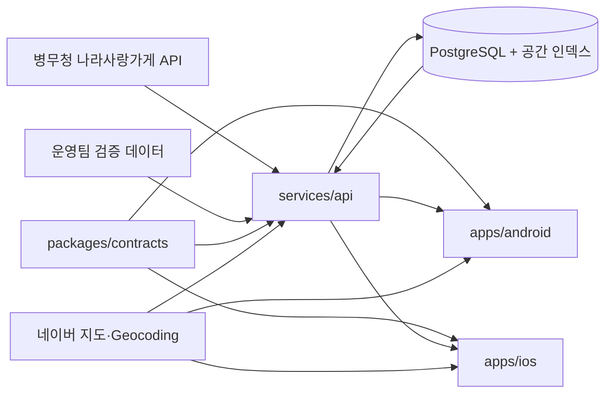

# 아키텍처

## 방향

현재 Android MVP는 빠른 검증을 위해 내장 SQLite와 로컬 인증을 사용합니다. 정식 서비스에서는 공공 API 키와 운영 데이터를 서버로 이동하고 Android·iOS가 같은 API 계약을 사용하도록 전환합니다.

## 영역별 책임

| 영역 | 책임 | 현재 상태 |
| --- | --- | --- |
| `apps/android` | Android 화면, 위치, 지도, 오프라인 폴백 | MVP 구현 |
| `apps/ios` | iOS 화면, 위치, 지도 | 예정 |
| `services/api` | 인증, 혜택 검색, 찜, 관리자, API 수집 | 예정 |
| `packages/contracts` | OpenAPI와 공용 데이터 모델 | 예정 |
| `data` | 원천 데이터, 근거, 검증 상태 | 초기 데이터 포함 |
| `infra` | 배포 환경과 비밀정보 주입 | 예정 |

## 데이터 흐름

1. 병무청 API 및 운영팀 검증 데이터를 서버 수집 작업이 가져옵니다.
2. 주소를 정규화하고 한 번만 Geocoding하여 좌표를 저장합니다.
3. 이름·주소·출처 식별자로 중복을 병합합니다.
4. 앱은 위치와 검색 범위를 서버에 보내고 거리순 결과를 받습니다.
5. 상세 화면은 혜택 내용뿐 아니라 출처, 최근 확인일, 상태를 함께 표시합니다.

## 단계적 전환

1. 현재 로컬 MVP로 탐색 경험을 검증합니다.
2. `packages/contracts`에 혜택·사용자·찜 API를 정의합니다.
3. `services/api`와 PostgreSQL/PostGIS를 구현합니다.
4. 인증·찜·관리자 CRUD를 서버로 이전합니다.
5. iOS 앱을 같은 계약으로 구현합니다.
