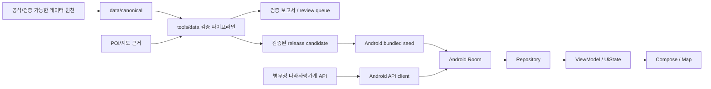

# 아키텍처

## 현재 승인된 기준

현재 실제 제품 아키텍처의 기준은 Android Room 통합 ADR과 최신 `dev` 코드입니다.

- Android 로컬 Source of Truth: Room
- data flow: Repository -> ViewModel -> UiState -> Compose
- UI: Jetpack Compose
- 지도/위치: Naver Map SDK + Android location layer
- 외부 병무청 데이터: Android API client를 통해 수집 후 Room cache/reconciliation
- 로그인·세션·찜·관리자: 현재 로컬 MVP
- bundled release seed: Room 초기/업데이트 데이터 경로

현재 Android 코드는 `BenefitDatabase` schema v4를 사용하고 `MIGRATION_1_2`, `MIGRATION_2_3`, `MIGRATION_3_4`를 유지합니다.

## 현재 데이터 검증 구조



위 데이터 흐름에서 위치와 군 혜택은 독립적으로 검증합니다. POI가 맞다는 사실은 혜택이 현재 유효하다는 증거가 아니고, 공식 혜택 목록의 존재는 현재 POI 좌표의 정확성을 보장하지 않습니다.

## Phase 1 검증 서브시스템

현재 다음으로 구현할 데이터 서브시스템은 `POI Verification Core / Shadow Mode`입니다.

```text
Canonical business row
        ↓
Normalization / Business Identity
        ↓
Adaptive POI Query + Candidate Collection
        ↓
Hard Constraints
        ↓
Candidate Ranking
        ↓
GREEN / YELLOW / RED
        ↓
Review Queue + Metrics
```

Phase 1은 canonical 또는 Android seed를 자동 수정하지 않습니다. GREEN도 자동 production 승인 상태가 아닙니다.

전체 장기 설계는 `docs/superpowers/specs/2026-09-10-benefit-business-verification-pipeline-design.md`를 따릅니다.

## 영역별 책임

| 영역 | 책임 | 현재 상태 |
| --- | --- | --- |
| `apps/android` | Android 화면, 지도/위치, ViewModel, Room, API client, 로컬 계정/찜/관리자 | MVP 구현 |
| `tools/data` | 원천 정규화, 공식 근거 대조, POI/좌표 검증, release artifact 생성 | 구현 및 확장 중 |
| `data/canonical` | 혜택·주소·좌표·출처·검증 상태의 정본 및 검증 보고서 | 운영 중 |
| `packages/contracts` | 향후 앱/서버 공용 계약 | Pending |
| `services/api` | 향후 서버 실행 영역 | Pending |
| `infra` | 향후 배포·비밀정보 주입 | Pending |
| iOS | 향후 클라이언트 | Pending |

## 아직 승인되지 않은 아키텍처

다음은 현재 확정된 아키텍처가 아닙니다.

- 서버 DB 제품/종류
- PostgreSQL/PostGIS 채택
- 서버 인증 방식
- Android 로컬 기능을 서버로 이전하는 구체적 순서
- 최종 API 계약
- iOS 데이터/지도 구현 방식
- 실시간/event-driven 인프라

이 항목들은 필요 시 별도 Issue/ADR 및 사용자 승인을 거쳐 결정합니다. 과거 문서에 등장한 구체적 서버 기술은 현재 승인으로 간주하지 않습니다.

## 변경 규칙

다음 변경은 별도 승인 없이 진행하지 않습니다.

- 핵심 아키텍처
- 데이터베이스 방식 또는 Room schema
- 신규 외부 라이브러리
- 인증 방식
- API 계약
- canonical/data schema

구현 전에는 Issue에 문제, 범위, 제외 범위, 예상 변경 파일, 테스트 방법, 위험을 명시합니다.
